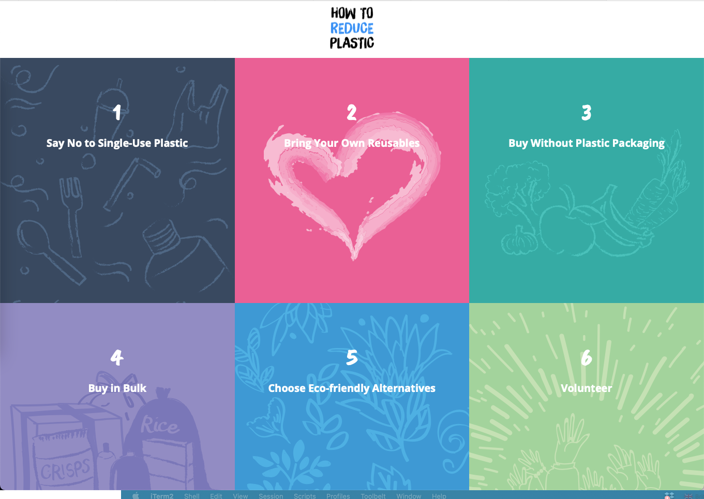

# How To Reduce Plastic



### Prerequisites

- Node <= v10.15.3
- npm v6.4.1
- gulp.js v2.2.0

### Start the app in Development

Run the following in two separate windows:

```
$ gulp
$ npm start
```

Open http://localhost:3000/ on your browser.
